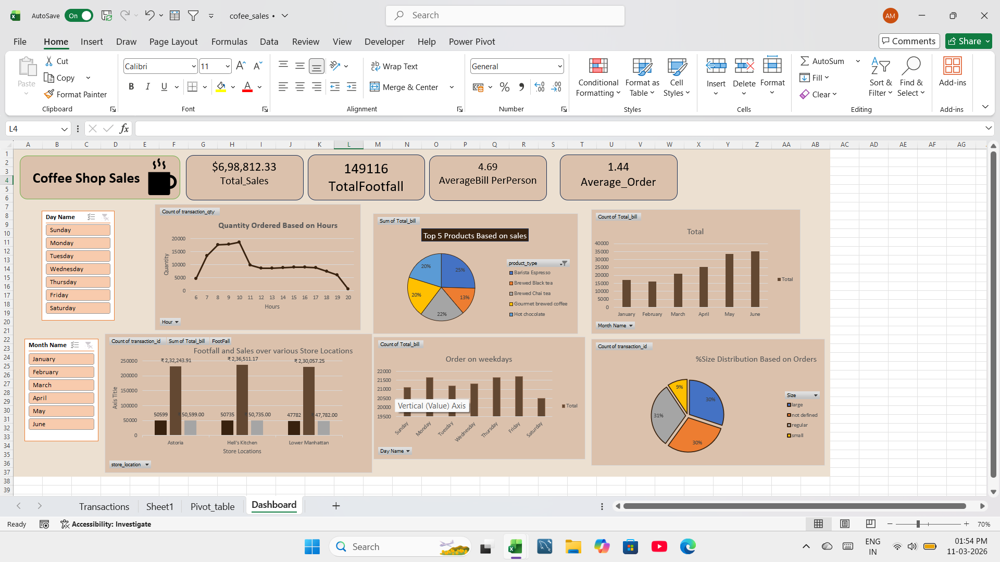
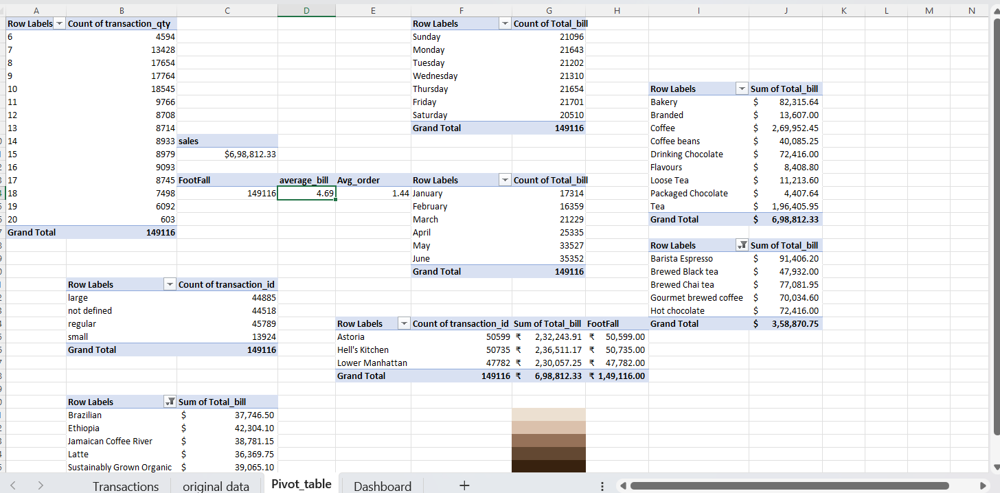

# Excel Data Cleaning and Dashboard Project

This project demonstrates the process of cleaning raw data and building an interactive dashboard in Excel using Power Query, Pivot Tables, and Charts.
## Dashboard Preview

---
## Pivot Table Analysis

---
## Project Workflow

1. Raw Data Collection
2. Data Cleaning using Power Query
3. Data Analysis using Pivot Tables
4. Dashboard Creation using Excel Charts and Slicers

---

## Files in this Repository

Raw_Coffee_Sales_data.xlsx  
Contains the original unprocessed dataset.

cofee_sales.xlsx  
Contains:
- Cleaned dataset
- Pivot tables used for analysis
- Final dashboard

---

## Data Cleaning Steps

The dataset was cleaned using Power Query by:

- Removing null and error values
- Formatting date columns
- Standardizing text values
- Handling missing data
- Removing duplicate records

---

## Dashboard Features

The dashboard provides insights such as:

- Total Sales
- Sales by Product Category
- Sales by Store Location
- Sales Trend Over Time

Interactive slicers allow filtering by:

- Product Category
- Store Location
- Date
## Tools Used
- Microsoft Excel
- Power Query
- Pivot Tables
- Excel Charts

---
## Author
Aadya
